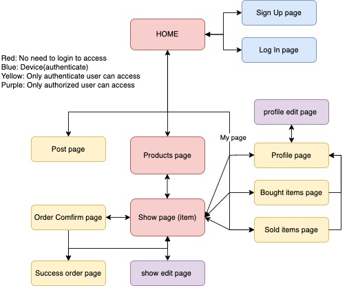
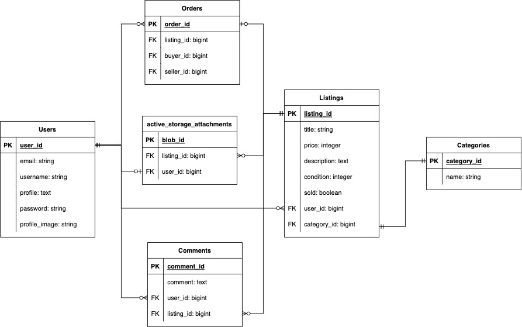

# Manabook 
## Links
- [ManaBook Website](https://manabook-production.up.railway.app/)

## Application Discription
### The problem to try to solve by building this particular marketplace app. Why should this problem be solved?  
1. Some people are wasting resources by throwing away their learning materials, such as textbooks that could still be used.
- This problem is not good for the environment and we need to save resources and energy. By reusing textbooks that are no longer in use, we can save the resources and energy used to produce new textbooks. When textbooks are discarded as recyclable waste, they are recycled as used paper, and so on, but this does not save the resources used to make new textbooks. 

2. The cost of learning materials is high, especially at university. 
- At the beginning of a new school year, students must purchase specific textbooks, which cost approximately $300 to $500 in total. These costs are not low, and not everyone can afford to get brand new textbooks. 
This marketplace application helps them offer cheaper prices. 

3. When you are trying to find a specific textbook on a website such as Amazon or e-bay, they have too many categories not involved in educational materials, so it takes time to find a specific book that you want.
- Usually, students must buy textbooks before their school courses begin. Therefore, they cannot waste time looking for textbooks.  

**This application is just for educational materials and will benefit everyone, including the environment!**

### Purpose
This application aims to save resources, protect the environment, and save money related to education by not trashing reusable items such as textbooks.

### Target audience
- All students
- Parents of students
- Adults who want to learn again

### User Stories
- As a user I want to see what are the textbooks listed.
- As a user I want to be able to sign up so I can sell or buy my textbooks.
- As a user I want to be able to log in with my new registered account.
- As a user I want to be able to edit my profile.
- As a user I want to be able to see if the products on the listing still on sale so I can buy only the products on sale.
- As a user I want to know the price of the products so I can compare which one is cheaper.
- As a user I want to know the category so I can save my time to find textbooks.
- As a user I want to know the condition of products so I can imagin how clean they are.

- As a user(buyer) I want to buy the textbooks that I want.
- As a user(buyer) I want to know if the textbook that I want is still on sale.
- As a user(buyer) I want to be able to see my bought items list.
- As a user(buyer) I want to be able to comment about the product to the seller so I can get more details of the product.
- As a user(buyer) I want to be able to get the confirmation before payment.

- As a user(seller) I want to be able to post my textbooks that I don't use anymore so I don't have to throw away them.
- As a user(seller) I want to be able to edit and delete my posts so I can manage my products.
- As a user(seller) I want to be able to reply to the comment from buyer so I can sell more easily and give them better services.
- As a user(seller) I want to be able to post the images of the textbook so I can explain how the condition of my products.
- As a user(seller) I want to be able to see my sold items list.


### Functionality / features
- Responsive design that allows for all the devices such as phone, tablet, laptop, and so on.
- Users are able to log in and sign up with their email address and password.
- The password must contain both single-byte alphanumeric characters.
- Only authenticate users are able to edit and update their profile.
- The listing products have image, title, condition, cotegory, price and link to seller profile.
- Users are able to upload up to 3 listing images.
- Users are able to comments unless the product is not sold out.
- Sellers can edit their own listing unless the item is not sold out.
- Sellers can delete their own listing.
- The listing has update time.
- Every comment has the time when they commented.
- The author of listing is able to delete comments.
- When you click the "buy this item" button, it shows order confirmation page with listing image and products infomation.
- In the success page, there is link to the product page that you bought.
- There are bought items page and sold items page in the my page link and users are able to see what they have sold and bought.
- Bought items page and sold items page has link to the item page and seller/buyer profile page.


### Tech stack (e.g. html, css, deployment platform, etc)
- HTML
- CSS/SCSS
- JavaScript
- Ruby on Rails
- Bulma
- Heroku
- AWS S3 

## Wireframes
[Wireframe link](https://whimsical.com/wireframe-Y2jjriauAbDShVJL4N4kwX)

## Sitemap


## Screenshots
Home Page  
  
Sign Up page  
  
Log In page  
  
Products index page  
  
Products Show page  
  
Post page   
  
Profile page  
  
Bought items page  
  
Sold items page  
  
Order confirmation page  
  
Order success page  
  

## The different high-level components (abstractions)  
This app uses the MVC architecture pattern, which influences the overall structure of the app. The C (controller) communicates with both the V (view) and M (model) and is the core of the app.   
The Model connects to the database and manages data. It communicates with the database in response to requests from the controller and passes the necessary data to the controller. In addition, a database is used to store data for a long period of time, and this app uses PostgreSQL, which is a database that allows multiple writes at the same time. Interacting with this database is a library called Active Record, which has methods for creating, storing, and retrieving data objects.   
The controller receives data from the model, processes it, instantiates all the information, and sends it to the view.  
View transforms the data received from the controller, sends it to Puma, the web server, and displays the results on the screen.  
Also, Rails' MVC architecture has the concept of inheritance, and by default, an MVC has a parent class. In the Model, ActiveRecord is applied via ApplicationRecord. Therefore, the database can be manipulated only with SQL, a database language, but since it inherits from ActiveRecord, the Model file can retrieve data from the database using the Ruby language. In this ActiveRecord, methods such as Create, Read, Update, and Delete are already defined, and these methods can be used in other files. In the controller, there is a file called Action Controller, which sets up the processing of requests by controller routing. In the view files, there is by default an application.html.erb file and all view files inherit from the file. For example, usually, all files must have metadata, etc. set within the `<head>` tag, but thanks to this application.html.erb file, there is no need to write a `<head>` tag in every view file.
In this way, the rails application uses the MVC architecture to make application development DRY and efficient.

## Detail third party services
- Devise  
Devise is a gem that handles the authentication functionality of Ruby on Rails. It provides login functions, hashes passwords and stores them in a database, etc., to make development more efficient. In this application, the defaults for Devise are customized. For example, the default validation of passwords is changed . Also, once Devise is installed, you can use the methods included with it. By using this Devise, it's able to easily implement the authentication functionality.  

- Bulma  
Bulma is a CSS framework for designing websites. It requires no JavaScript and consists only of CSS. It is responsive and covers all commonly used elements. Styles are defined by classes, so you can style your website by simply writing class names.  

- Amazon S3 Bucket  
A storage service provided by Amazon Web Services (AWS) that stores objects consisting of data and its metadata in a bucket you create. In this application, it is used to store uploaded image data. The closest region (Sydney) from Melbourne was selected to reduce latency and cost.  

- Heroku  
It provides the environment for the database and server to run the app. Heroku takes care of all the steps necessary to publish the app with a service called PaaS (Platform as a Service). The disadvantage is that if there are no requests to the server for a while, the server shuts down and all files uploaded to the server will disappear due to this effect. To solve this problem, an external storage provider called Amazon S3 is used to permanently retain all uploaded files even if the server shuts down.  


## ERD


### Models in terms of the relationships (active record associations)   
- **User model(user information)**  
has_many :listings, dependent: :destroy  
has_many :comments, dependent: :destroy  
has_many :sold_orders  
has_many :bought_orders  
has_one_attached :profile_image, dependent: :destroy   The profile image stored in Amazon S3 through active strage.  
Listings, comments and images that related with users are deleted when a user account is deleted. Sold_orders and bought_orders are from Order model(class) through by seller_id and buyer_id as a foreign key.  

- **Listing model(details of each product information)**  
belongs_to :user  
belongs_to :category  
has_many :comments, dependent: :destroy  
has_one :order, dependent: :destroy  
has_many_attached :list_images, dependent: :destroy  
The images are stored in Amazon S3 through active strage. Comments, orders and images that related with listings are deleted when a listing(product) is deleted.  Listing has a user_id and category_id as a foreign key, so it belongs to user and category.

- **Category model(product's category information)**  
has_one :listing, dependent: :destroy  
When the listings are deleted, the category related in it also will delete.

- **Comment model(details of each comment for products information)**  
belongs_to :user  
belongs_to :listing  
Comment has a user_id and listing_id as a foreign key, so it belongs to user and listing.

- **Order model(stores each listing information that is ordered and users(seller and buyer) information)**  
belongs_to :listing  
belongs_to :buyer  
belongs_to :seller  
Order has a listing_id as a foreign key, so it belongs to listing. It also belongs to buyer and seller which are users through a buyer_id and seller_id. It sets a buyer_id and seller_id as a user_id which is in the User model(class).

### The database relations to be implemented  
- **One to One relationship**  
This relation is when a column in one table is related to exactly one column in the other table.  
**Listing - Order**  
A listing has 0 or one order and order has only one listing. For example, if a listing item isn't sold, it can't have any order, but if it's sold out, it can have one order. Also, order only have one listing because it can have listing only when the listing is bought.  
**Listing - Category**  
Listing have only one category and category also have only one listing. Listing have to have one category, so when listing created, category must have one listing as well.  
**User - Profile image**  
User has 0 or one profile image, and profile image has only one user.  
   
- **One to Many relations**  
The one-to-many relationship indicates that one column in one table (the parent table) is related to many rows in the other table (the child table).  
**User - Order**  
User has 0 or many orders, and order has only one user. Users don't have to have any order, but are able to have many orders. And, each order can't exist unless user order something, and it must be ordered by only one user.  
**User - Listing**  
User has 0 or many listings, and listing has only one user. Users don't have to post any listing, but are able to have many listings. And, each listing can't exist unless user post listing, and it must be posted by only one user.  
**User - Comment**  
User has 0 or many comments, and comment has only one user.  Users don't have to write any comment, but are able to write many comments. And, each comment can't exist unless user write comment, and it must be written by only one user.  
**Listing - Comment**  
Listing has 0 or many comments and comment has one listing. Listing can exists without any comment or have many comments, but each comment can't exist unless listing create.  
**Listing - Listing image**  
Listing has 0 or more listing images, and the images has only one listing. Listing can exists without any image or have many images, but each image can't exist unless listing create. 

### Database schema design  
```
ActiveRecord::Schema.define(version: 2022_07_08_093755) do

  # These are extensions that must be enabled in order to support this database
  enable_extension "plpgsql"

  create_table "action_text_rich_texts", force: :cascade do |t|
    t.string "name", null: false
    t.text "body"
    t.string "record_type", null: false
    t.bigint "record_id", null: false
    t.datetime "created_at", precision: 6, null: false
    t.datetime "updated_at", precision: 6, null: false
    t.index ["record_type", "record_id", "name"], name: "index_action_text_rich_texts_uniqueness", unique: true
  end

  create_table "active_storage_attachments", force: :cascade do |t|
    t.string "name", null: false
    t.string "record_type", null: false
    t.bigint "record_id", null: false
    t.bigint "blob_id", null: false
    t.datetime "created_at", null: false
    t.index ["blob_id"], name: "index_active_storage_attachments_on_blob_id"
    t.index ["record_type", "record_id", "name", "blob_id"], name: "index_active_storage_attachments_uniqueness", unique: true
  end

  create_table "active_storage_blobs", force: :cascade do |t|
    t.string "key", null: false
    t.string "filename", null: false
    t.string "content_type"
    t.text "metadata"
    t.string "service_name", null: false
    t.bigint "byte_size", null: false
    t.string "checksum", null: false
    t.datetime "created_at", null: false
    t.index ["key"], name: "index_active_storage_blobs_on_key", unique: true
  end

  create_table "active_storage_variant_records", force: :cascade do |t|
    t.bigint "blob_id", null: false
    t.string "variation_digest", null: false
    t.index ["blob_id", "variation_digest"], name: "index_active_storage_variant_records_uniqueness", unique: true
  end

  create_table "categories", force: :cascade do |t|
    t.datetime "created_at", precision: 6, null: false
    t.datetime "updated_at", precision: 6, null: false
    t.string "name"
  end

  create_table "comments", force: :cascade do |t|
    t.text "comment"
    t.bigint "user_id", null: false
    t.datetime "created_at", precision: 6, null: false
    t.datetime "updated_at", precision: 6, null: false
    t.bigint "listing_id", null: false
    t.index ["listing_id"], name: "index_comments_on_listing_id"
    t.index ["user_id"], name: "index_comments_on_user_id"
  end

  create_table "listings", force: :cascade do |t|
    t.string "title"
    t.integer "price"
    t.text "description"
    t.integer "condition"
    t.boolean "sold", default: false
    t.bigint "user_id", null: false
    t.bigint "category_id", null: false
    t.datetime "created_at", precision: 6, null: false
    t.datetime "updated_at", precision: 6, null: false
    t.index ["category_id"], name: "index_listings_on_category_id"
    t.index ["user_id"], name: "index_listings_on_user_id"
  end

  create_table "orders", force: :cascade do |t|
    t.bigint "listing_id", null: false
    t.bigint "buyer_id", null: false
    t.bigint "seller_id", null: false
    t.datetime "created_at", precision: 6, null: false
    t.datetime "updated_at", precision: 6, null: false
    t.index ["buyer_id"], name: "index_orders_on_buyer_id"
    t.index ["listing_id"], name: "index_orders_on_listing_id"
    t.index ["seller_id"], name: "index_orders_on_seller_id"
  end

  create_table "users", force: :cascade do |t|
    t.string "email", default: "", null: false
    t.string "encrypted_password", default: "", null: false
    t.string "reset_password_token"
    t.datetime "reset_password_sent_at"
    t.datetime "remember_created_at"
    t.string "username"
    t.text "profile"
    t.string "profile_image"
    t.datetime "created_at", precision: 6, null: false
    t.datetime "updated_at", precision: 6, null: false
    t.index ["email"], name: "index_users_on_email", unique: true
    t.index ["reset_password_token"], name: "index_users_on_reset_password_token", unique: true
  end

  add_foreign_key "active_storage_attachments", "active_storage_blobs", column: "blob_id"
  add_foreign_key "active_storage_variant_records", "active_storage_blobs", column: "blob_id"
  add_foreign_key "comments", "listings"
  add_foreign_key "comments", "users"
  add_foreign_key "listings", "categories"
  add_foreign_key "listings", "users"
  add_foreign_key "orders", "listings"
  add_foreign_key "orders", "users", column: "buyer_id"
  add_foreign_key "orders", "users", column: "seller_id"
end
```

## The way tasks are allocated and tracked
To manage and track the tasks, I used Trello board. All the tasks are in the `Planning` section, and move to `To Do` section before the task due will coming. And once the tasks in the `To Do` is done, the task will be moved to the `Done` section. All the tasks have due day, task's level label(small, medium, large, option), and the process of application label (ready to app, building app, and finishing app). 
(There are optional functions in the `function/features` section for the future. )   
  
**Day 1**  
- Wireframe  
- ERD  
- About the problem to solve and reasons  

  
**Day 2**  
- Set up devise  
- User stories   


**Day 3**  
- Sitemap  
- Devise  
- Create all the models and controllers  


**Day 4**  
- Set up Active Strage and AWS S3 bucket Image  
- Set up Image and category model  
  


**Day 5**   
- create user profile pages, listing form, listing show page.  


**Day 6**   
- Implement comment function  
- create comment page  


**Day 7**   
- Implement order function  
  


**Day 8,9**   
- Layout/design for user profile page, user edit page, Listing show page and index page. (bulma)  
- deploying to heroku  
.png)  


**Day 10**   
- deploying to heroku  
- Layout/design for order pages  


**Day 11**   
- validation  
- implement sold items page and bought items page  
  
.png)

**Day 12**   
- Listing show page image layout  
- Home top page design/layout  


**Day 13,14**   
- Prepare for presentation  
- Made a slide  


**Day 15,16**   
- Testinf if every functions works well  
- README documentation  


**Day 17,18**   
- Fixed ERD  
- README documentation  


**Day 19**   
- Add code comments to the queries  

  

[Trello link:](https://trello.com/b/RqHi8SlS/assignment-marketplace-application)

## Reference 
[reference](./app/assets/images/reference.pdf)
